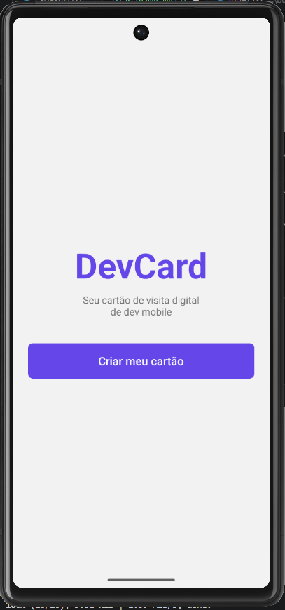
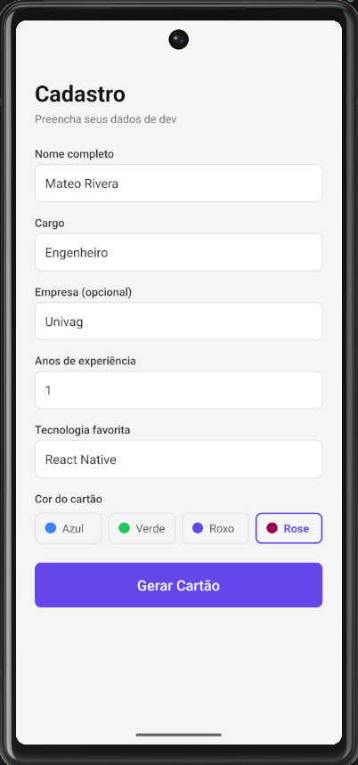
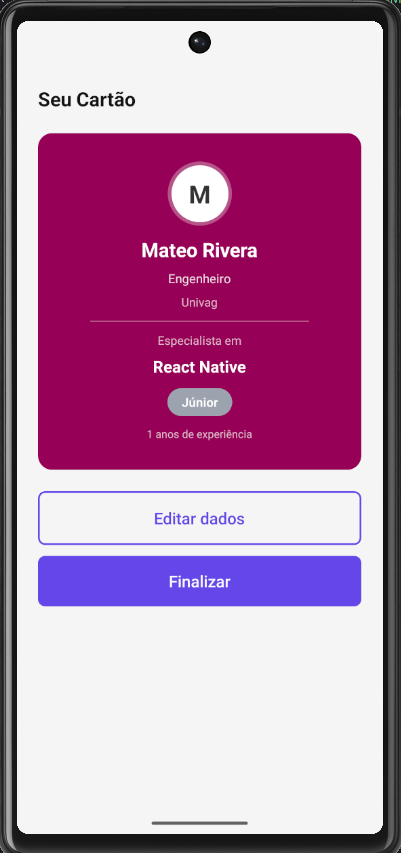
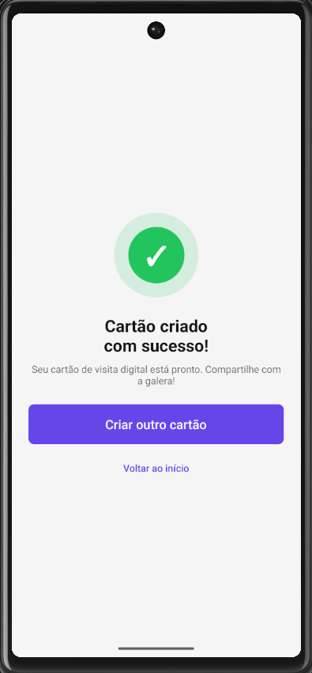

# DevCard

Cartão de visita digital para desenvolvedores mobile, criado como atividade prática da disciplina de Aplicações Móveis.

autor: Mateo Hernan Rivera Henrique

# Telas

### Boas-vindas
Tela inicial com o logo do app e botão para começar.

### Cadastro
Formulário com nome, cargo, empresa, anos de experiência, tecnologia favorita e cor do cartão.

### Preview
Exibe o cartão gerado com badge de nível automático:
- 0 a 2 anos → Júnior
- 3 a 5 anos → Pleno
- 6 ou mais → Sênior

### Sucesso
Confirmação de que o cartão foi criado com sucesso.

# Print

